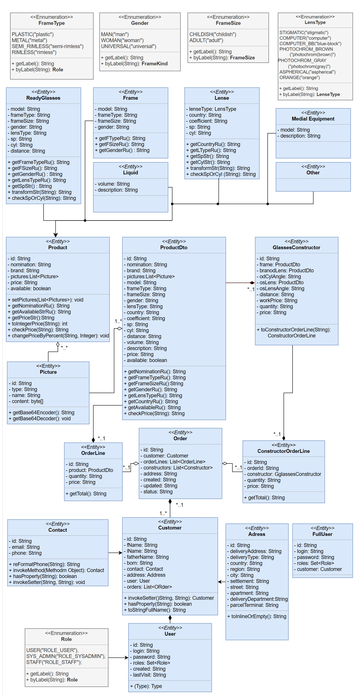

# OpticsShop
___
### Java web application of optics store. It's contains UI and postgreSQL database.
___

## Used technologys:
> + [x] **HTML**
> + [x] **CSS**
> + [x] **Javascript**
> + [x] **PostgreSQL 16.0**
> + [x] **Docker compose 3.2.0**
> + [x] **Java JDK-19**
>> + [x] **Spring 3.2.0**:
>>> + [x] Web
>>> + [x] MVC _(Model View Controller)_
>>> + [x] Restfull API
>>> + [x] Security
>>> + [x] Security test
>>> + [x] Junit-5 Jupiter
>>> + [x] Test containers
>>> + [x] Flyway
>>> + [x] JPA _(Java Persistence API)_
>>> + [x] Thymeleaf

___

## Tests
> + [x] _Unit_ tests: _440_
> + [x] _Integration_ tests: _39_
> + [x] __Total tests:__ _479_

___

## Application structure
 

___

## UI screenshots
[Click hear to see screenshots!](Screenshots/Screenshots.md)